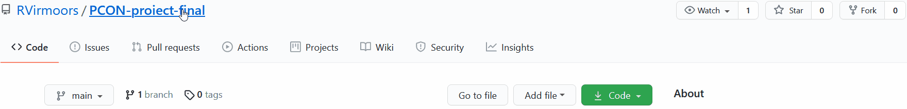
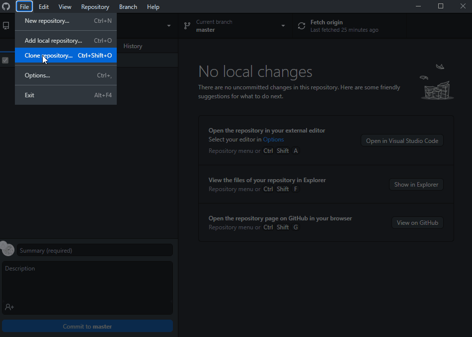
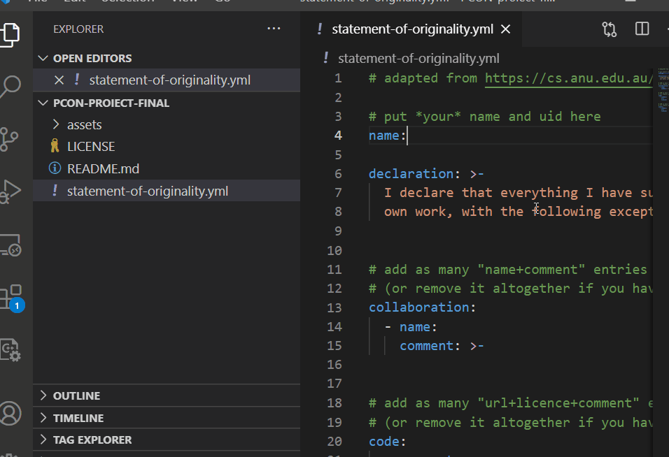

#  Sound Shifter
Programul are rolul de a modifica vocea umana, prin captarea sunetul inregistrat de catre un microfon si transformarea semnalul prin diferite efecte audio (Reverb, Saturator, Modulatie etc)

## (Instalare)
Pentru realizarea acestui program, am avut nevoie de cateva plugin-uri externe, utilizate in mod uzual in domeniul audio pentru editarea vocii. De asemenea, am realizat si un control de la tastatura (utilizand codul ASCII), pentru folosirea acestor efecte doar prin apasarea unor taste.

## (Utilizare)
Fiecare efect are un indicativ (de exemplu pentru Xvox SFX este EF1), iar gestionarea acestora se poate face utilizand tastele 1-5.
Activarea/Dezactivarea microfonului se poate realiza cu ajutorul tastei M.

## (Istoric)

(15.05) Prima implementare in MAX a unui efect (pentru test) 

(29.05) Implemenarea aproape finala a proiectului, ramanand de realizat partea finala si documentatia

(17.06) Forma finala

## (Link-uri)
https://www.youtube.com/watch?v=uyzY_ZP54pA

# Dezvoltarea proiectului

Pentru început:

1. Creează-ți cont pe Github
2. Download și install [Github Desktop](https://desktop.github.com/)
3. Citește [acest ghid](https://charlesmartin.com.au/blog/2020/08/09/student-project-repository) și ține la îndemână [Markdown Cheat Sheet](https://www.markdownguide.org/cheat-sheet).

Apoi, procesul este următorul (inspirat de [aici](https://cs.anu.edu.au/courses/comp1720/deliverables/05-major-project/#submission-process)):

1. *fork* al acestui template către propriul tău cont de Github

_(dacă preferi cumva ca repo-ul să nu fie vizibil de către public, îl poți seta ca Private din Settings - "Change visibility". Atunci trebuie să mă adaugi drept colaborator, ca eu să am acces.)_

2. *clone* al repo-ului din Github Desktop pentru a-l downloada local

3. *commit* și *push* pe măsură ce lucrezi la proiect. Ultima versiune push-ată pe server înainte de deadline va conta pentru evaluare.

## Elemente obligatorii

1. Acest readme completat. Titlu, descriere, mod de utilizare, istoric, link-uri utile.

   Poți include și imagini și chiar [gif-uri animate](https://www.screentogif.com/), sau link-uri către materiale audio/video.
   
   Vezi [aici](https://charlesmartin.com.au/blog/2020/08/09/student-project-repository) mai multe sugestii.

2. [Declarația de originalitate](statement-of-originality.yml) completată. Tot ce nu este inclus acolo va fi considerat 100% contribuție proprie.

    *(formatul este adaptat de [aici](https://gitlab.cecs.anu.edu.au/comp1720/2018/comp1720-2018-major-project/-/blob/master/statement-of-originality.yml). Da, este un pic ironic să refolosim un doc [de altundeva](https://cs.anu.edu.au/courses/comp1720/resources/faq/#how-do-i-fill-out-my-statement-of-originality), dar menționăm sursa deci nu este plagiat!)*

3. Proiectul în sine. Tot codul trebuie să fie prezent, proiectul trebuie să poată rula conform instrucțiunilor din readme. Dacă e nevoie de asset-uri mari (sunete, video etc), [folosește Git LFS](https://git-lfs.github.com/) sau include link de download în instrucțiunile de instalare.

